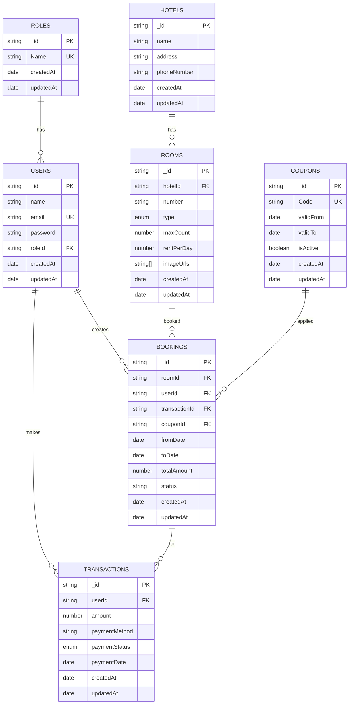

# Data Modelling

Database schema for the Hotel Booking System using **7 collections**: Roles, Users, Hotels, Rooms, Coupons, Bookings, and Transactions.

---

## Entity Relationship Diagram

---

## Collections Overview

| Collection | Purpose | 
|------------|---------|
| **ROLES** | User role definitions (admin/user)|
| **USERS** | User accounts and authentication |
| **HOTELS** | Hotel information and details |
| **ROOMS** | Individual room details per hotel |
| **COUPONS** | Payment done via coupon |
| **BOOKINGS** | Room reservations |
| **TRANSACTIONS** | Payment records |

---

## Schema Details

### ROLES
| Field | Type | Constraint | Description |
|-------|------|------------|-------------|
| _id | string | PK | Unique identifier for the role |
| Name | string | Unique | Role name (e.g., admin, user) |
| createdAt | date | - | Timestamp when role was created |
| updatedAt | date | - | Timestamp when role was last updated |

### USERS
| Field | Type | Constraint | Description |
|-------|------|------------|-------------|
| _id | string | PK | Unique identifier for the user |
| name | string | - | Name of the user |
| email | string | Unique | User's email address for login |
| password | string | - | Encrypted password |
| roleId | string | FK → ROLES | Reference to user's role |
| createdAt | date | - | Account creation timestamp |
| updatedAt | date | - | Last profile update timestamp |

### HOTELS
| Field | Type | Constraint | Description |
|-------|------|------------|-------------|
| _id | string | PK | Unique identifier for the hotel |
| name | string | - | Name of the hotel |
| address | string | - | Physical address of the hotel |
| phoneNumber | string | - | Contact phone number |
| createdAt | date | - | Record creation timestamp |
| updatedAt | date | - | Last update timestamp |

### ROOMS
| Field | Type | Constraint | Description |
|-------|------|------------|-------------|
| _id | string | PK | Unique identifier for the room |
| hotelId | string | FK → HOTELS | Reference to the hotel |
| number | string | - | Room number/identifier |
| type | enum | Deluxe/Standard | Room category |
| maxCount | number | - | Maximum occupancy capacity |
| rentPerDay | number | - | Daily rental price |
| imageUrls | string[] | - | Array of room image URLs |
| createdAt | date | - | Record creation timestamp |
| updatedAt | date | - | Last update timestamp |

### COUPONS
| Field | Type | Constraint | Description |
|-------|------|------------|-------------|
| _id | string | PK | Unique identifier for the coupon |
| Code | string | Unique | Coupon code for redemption |
| validFrom | date | - | Start date of coupon validity |
| validTo | date | - | End date of coupon validity |
| isActive | boolean | - | Whether coupon is currently active |
| createdAt | date | - | Record creation timestamp |
| updatedAt | date | - | Last update timestamp |

### BOOKINGS
| Field | Type | Constraint | Description |
|-------|------|------------|-------------|
| _id | string | PK | Unique identifier for the booking |
| roomId | string | FK → ROOMS | Reference to booked room |
| userId | string | FK → USERS | Reference to user who booked |
| transactionId | string | FK → TRANSACTIONS | Reference to payment transaction |
| couponId | string | FK → COUPONS | Reference to applied coupon  |
| fromDate | date | - | Check-in date |
| toDate | date | - | Check-out date |
| totalAmount | number | - | Total booking amount |
| status | string | - | Booking status (confirmed/cancelled/pending) |
| createdAt | date | - | Booking creation timestamp |
| updatedAt | date | - | Last modification timestamp |

### TRANSACTIONS
| Field | Type | Constraint | Description |
|-------|------|------------|-------------|
| _id | string | PK | Unique identifier for the transaction |
| userId | string | FK → USERS | Reference to user who made payment |
| amount | number | - | Transaction amount |
| paymentMethod | string | - | Payment done via coupon |
| paymentStatus | enum | Success/Failed | Current status of payment |
| paymentDate | date | - | Date when payment was made |
| createdAt | date | - | Record creation timestamp |
| updatedAt | date | - | Last update timestamp |

---

## Relationships

| From | To | Type | Description |
|------|-----|------|-------------|
| ROLES | USERS | 1:N | Each role can have multiple users |
| HOTELS | ROOMS | 1:N | Each hotel can have multiple rooms |
| USERS | BOOKINGS | 1:N | Each user can make multiple bookings |
| USERS | TRANSACTIONS | 1:N | Each user can have multiple transactions |
| ROOMS | BOOKINGS | 1:N | Each room can have multiple bookings |
| COUPONS | BOOKINGS | 1:N | Each coupon can be used in multiple bookings |
| BOOKINGS | TRANSACTIONS | 1:N | Each booking can have multiple transactions (e.g., Successful transactions,failed transactions) |

## Database Indexing 

| Collection/Table | Index Type | Fields | Purpose | Notes |
|-----------------|------------|--------|---------|-------|
| **USERS** | Singular | `email` | Unique user lookup during login/registration | 
| **BOOKINGS** | Composite | `userId + status` | Query user's bookings filtered by status (active/cancelled/completed) | 
| **BOOKINGS** | Composite | `fromDate + toDate` | Find bookings within date ranges, check room availability | 
