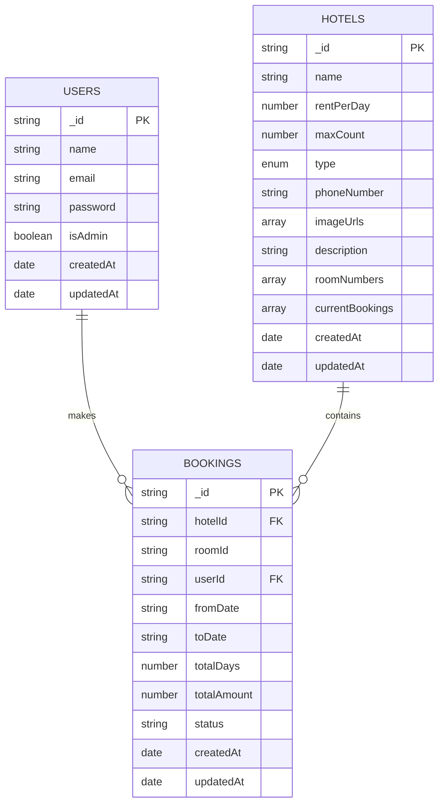

# Data Modelling

## Overview
This document describes the database schema with 3 collections: Users, Hotels, and Bookings.

---

## Entity Relationship Diagram

```mermaid
erDiagram
    USERS ||--o{ BOOKINGS : "makes"
    HOTELS ||--o{ BOOKINGS : "contains"

    USERS {
        string _id PK
        string name
        string email
        string password
        boolean isAdmin
        date createdAt
        date updatedAt
    }

    HOTELS {
        string _id PK
        string name
        number rentPerDay
        number maxCount
        enum type
        string phoneNumber
        array imageUrls
        string description
        array roomNumbers
        array currentBookings
        date createdAt
        date updatedAt
    }

    BOOKINGS {
        string _id PK
        string hotelId FK
        string roomId
        string userId FK
        string fromDate
        string toDate
        number totalDays
        number totalAmount
        string status
        date createdAt
        date updatedAt
    }
```

---

## Collections Overview

| Collection | Purpose |
|------------|---------|
| **Users** | Store user and admin information |
| **Hotels** | Store hotel details and room numbers |
| **Bookings** | Store bookings for specific rooms |

---

## 1. Users Collection

**Example Document:**
```json
{
  "_id": "65fa...",
  "name": "Khush Tiwari",
  "email": "khush@example.com",
  "password": "hashedpassword",
  "isAdmin": true,
  "createdAt": "2025-11-10T10:15:00Z",
  "updatedAt": "2025-11-12T14:15:00Z"
}
```

**Key Fields:**

| Field | Description |
|-------|-------------|
| `isAdmin` | Grants access to admin dashboard |

---

## 2. Hotels Collection

**Example Document:**
```json
{
  "_id": "69155b676edadcc5fb741f6c",
  "name": "Capital O 15959 The City Park Hotel",
  "rentperday": 1800,
  "maxcount": 3,
  "type": "Non-Delux",
  "phonenumber": "9989649278",
  "imageurls": [
    "url1",
    "url2",
    "url3"
  ],
  "roomnumbers": [
    { "roomid": "101", "status": "available" },
    { "roomid": "102", "status": "available" },
    { "roomid": "103", "status": "available" }
  ],
  "currentbookings": [
    {
      "bookingid": "69211c53d2a79d089d2105d5",
      "roomid": "101",
      "fromdate": "01-11-2025",
      "todate": "03-11-2025",
      "userid": "691c0a83146c5b17464eaaf0",
      "status": "booked"
    }
  ]
}
```

**Key Fields:**

| Field | Description |
|-------|-------------|
| `roomnumbers` | Physical room numbers (101, 102...) |
| `currentbookings` | Active bookings for each room |

---

## 3. Bookings Collection

**Example Document:**
```json
{
  "_id": "69211d3bd2a79d089d2105df",
  "hotelid": "69155b676edadcc5fb741f69",
  "roomid": "102",
  "userid": "691c0a83146c5b17464eaaf0",
  "fromdate": "01-11-2025",
  "todate": "03-11-2025",
  "totaldays": 3,
  "totalamount": 4500,
  "status": "booked"
}
```

**Key Fields:**

Each booking references:

- A hotel
- A specific room number
- A user
