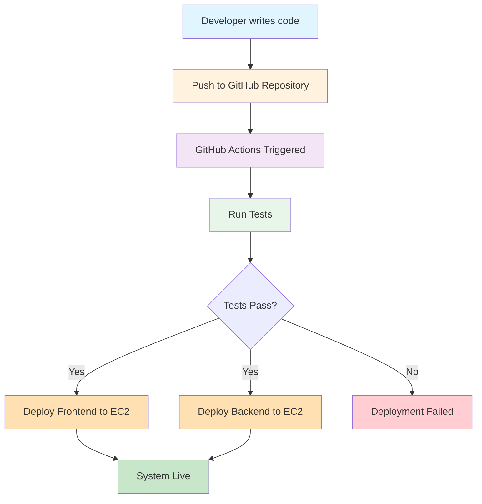
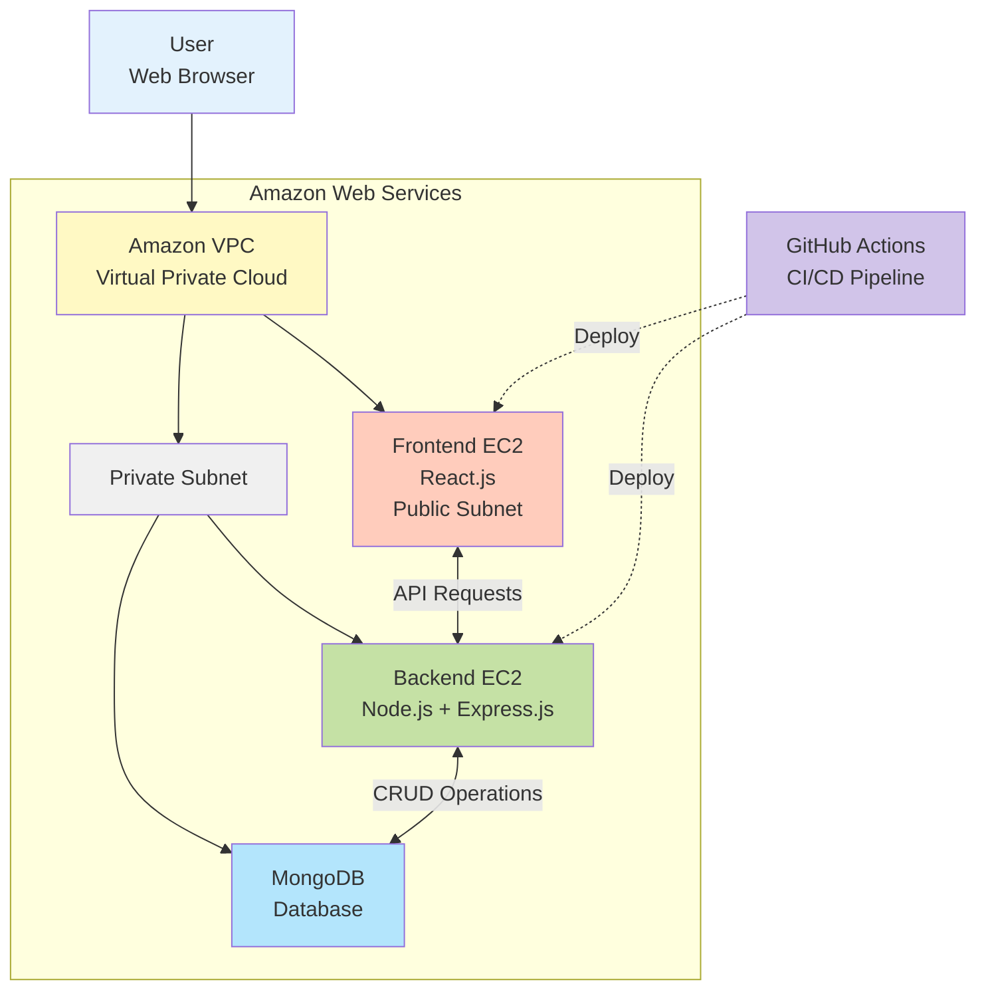
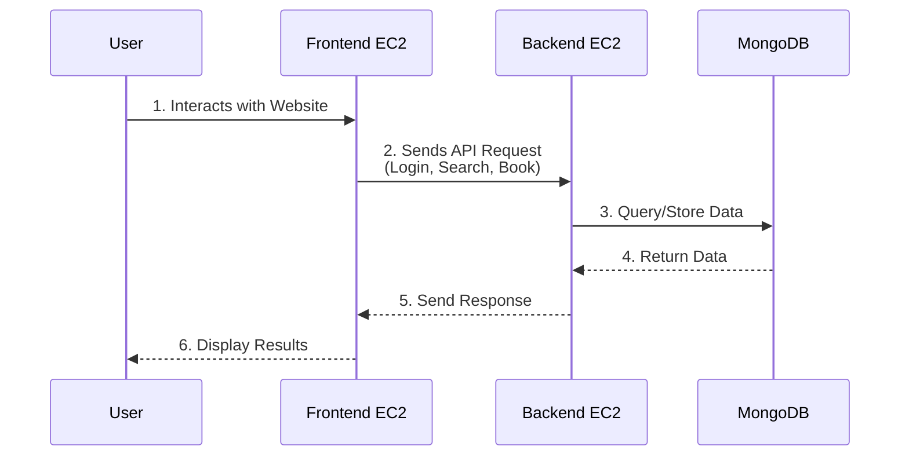

# Technical Documentation

## Architecture Diagram

    

---

## Deployment Flow

---

## System Architecture

---

## Component Description

| Component | Technology | Description |
|-----------|------------|-------------|
| **User** | Web Browser | Accesses the hotel booking website through a web browser |
| **Amazon Cloud** | AWS | Provides scalability, security, and reliability for the entire system |
| **VPC** | Virtual Private Cloud | Isolated network environment for secure communication, protects system from unauthorized access |
| **Frontend EC2** | React.js | User interface displaying hotel rooms, booking forms, and user dashboard. Deployed automatically via GitHub Actions |
| **Private Subnet** | AWS Network | Secure zone isolated from public internet, contains Backend and Database for enhanced security |
| **Backend EC2** | Node.js + Express.js | Handles business logic and API requests, processes user authentication, bookings, and payments |
| **MongoDB** | NoSQL Database | Stores all application data  |
| **GitHub Actions** | CI/CD Pipeline | Automated deployment from GitHub repositories to EC2 servers with separate workflows for Frontend and Backend |

---

## Data Flow

### Flow Explanation

| Step | From | To | Action |
|------|------|-----|--------|
| 1 | User | Frontend | User interacts with the website (search hotels, make bookings) |
| 2 | Frontend | Backend | Sends API requests for login, room search, booking operations |
| 3 | Backend | MongoDB | Queries and stores data in the database |
| 4 | MongoDB | Backend | Returns requested data |
| 5 | Backend | Frontend | Sends response with processed data |
| 6 | Frontend | User | Displays results on the user interface |
