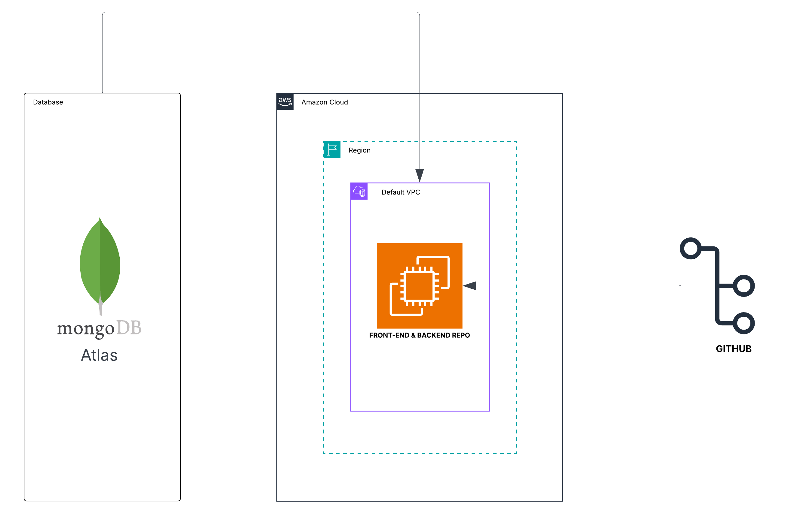
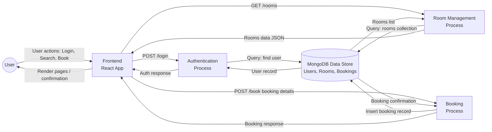
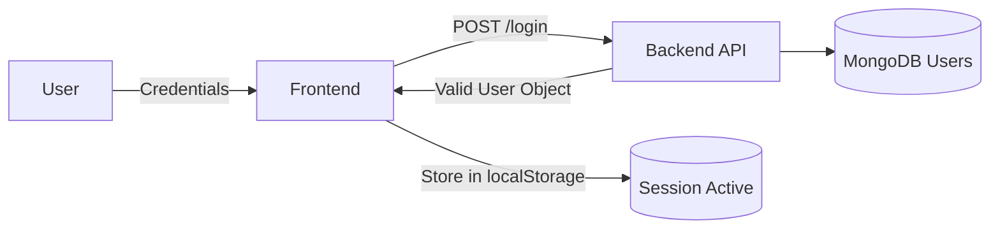
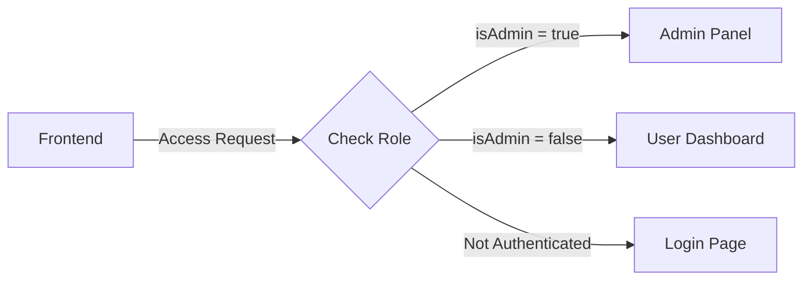

# Technical Documentation

## Architecture Diagram

This architecture illustrates the deployment workflow for the application, integrating MongoDB Atlas with AWS infrastructure. It includes separate EC2 instances for the frontend and backend, each connected to their respective GitHub repositories for continuous updates.

---

## Tech Stack and sevices used

| Layer              | Technologies                                               |
|--------------------|------------------------------------------------------------|
| Frontend           | React.js, JavaScript, Axios, Bootstrap                    |
| Backend            | Node.js, Express.js, JWT, bcrypt, Mongoose                |
| Database           | MongoDB Atlas                                             |
| Infrastructure     | AWS Cloud, Default VPC, Region                            |
| Version Control    | GitHub                                                    |
| Additional Tools   | npm, nodemon,  Postman                             |

---
## Data Flow Diagram 

This diagram illustrates the high-level movement of data across the MERN stack.
When a user interacts with the React application, the frontend sends requests to the Node.js/Express backend. The backend processes these requests, applies business logic, and retrieves or modifies information stored in MongoDB. The response is then returned to the frontend, where it is rendered for the user.

## Data Flow Diagram

This flow ensures a clear separation of responsibilities:

- **Frontend (React)** handles UI and user interactions.
- **Backend (Express)** manages API logic and validations.
- **Database (MongoDB)** stores rooms, users, bookings, and coupon data.

---

## Authentication

Authentication verifies the identity of the user before allowing access to application features.  
In this MERN application, authentication is handled through the `POST /api/users/login` API, where the frontend sends user credentials to the backend. The backend validates the credentials against the MongoDB `users` collection and returns a user object on success.

The frontend stores this user data in `localStorage` and uses it to maintain the session.  
Only authenticated users can access restricted pages such as Profile and Booking.

---

## Authorization

Authorization defines **what a user is allowed to do** after they are authenticated.  
This system uses two levels of access:

- **Normal User**  
  Can view rooms, make bookings, and manage their profile.

- **Admin User**  
  Has elevated access to manage rooms, bookings, and users through the Admin Panel.

Authorization is enforced on the frontend using:
- `PrivateRoute` for user-protected pages  
- `AdminRoute` for admin-only pages  

The backend also validates admin privileges during sensitive operations by checking the `isAdmin` field in the `users` collection.

---

## How Services Communicate

Authentication and authorization flow between layers is consistent:

- **Frontend → Backend**  
  Sends login, registration, booking, and admin actions with the authenticated user’s ID.

- **Backend → Database**  
  Validates and fetches data from `users`, `rooms`, and `bookings` collections.

- **Frontend → Local Storage**  
  Maintains active user session for protected routes.

The flow ensures secure, role-based access throughout the system.

