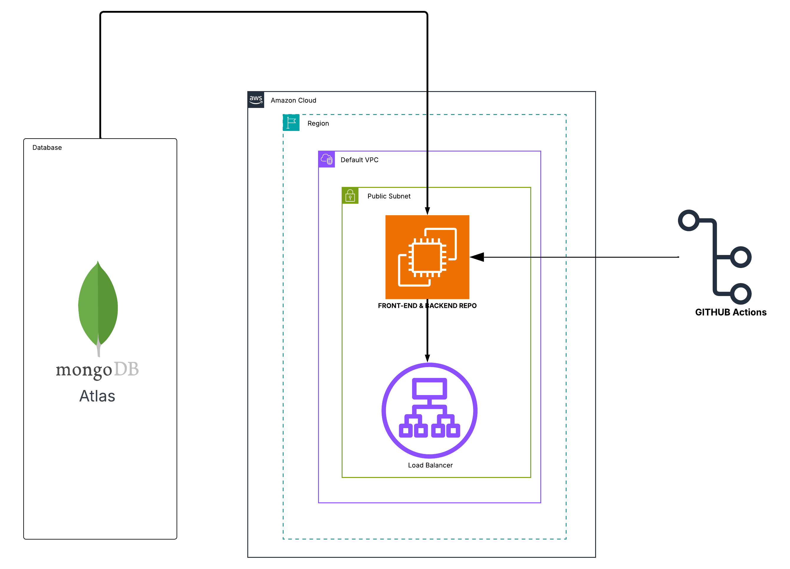
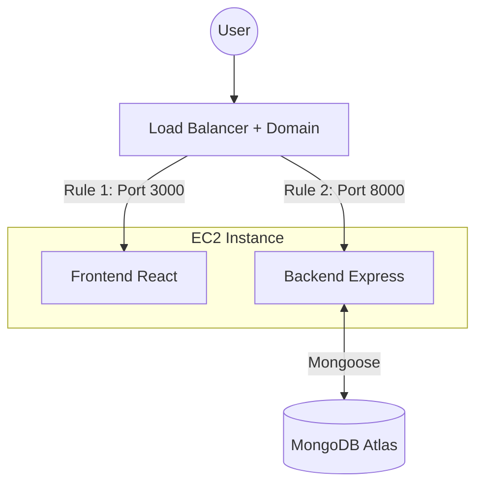
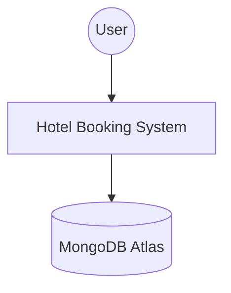
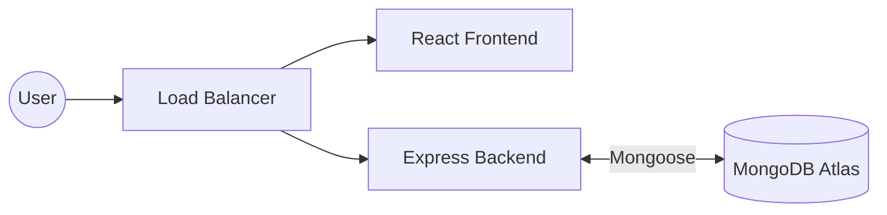
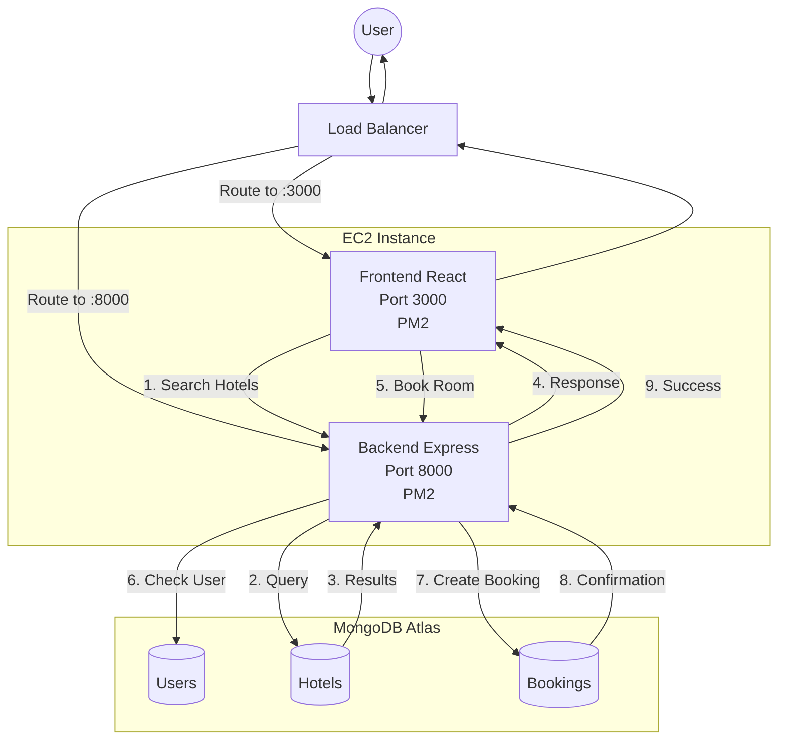
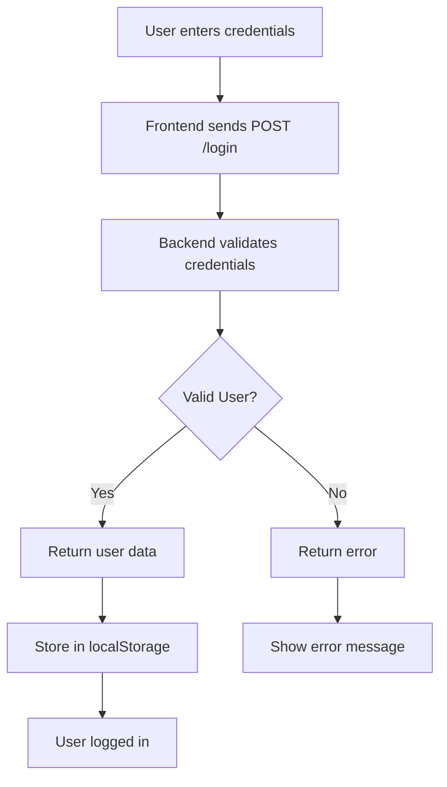
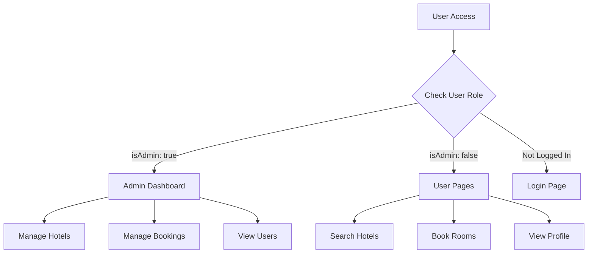
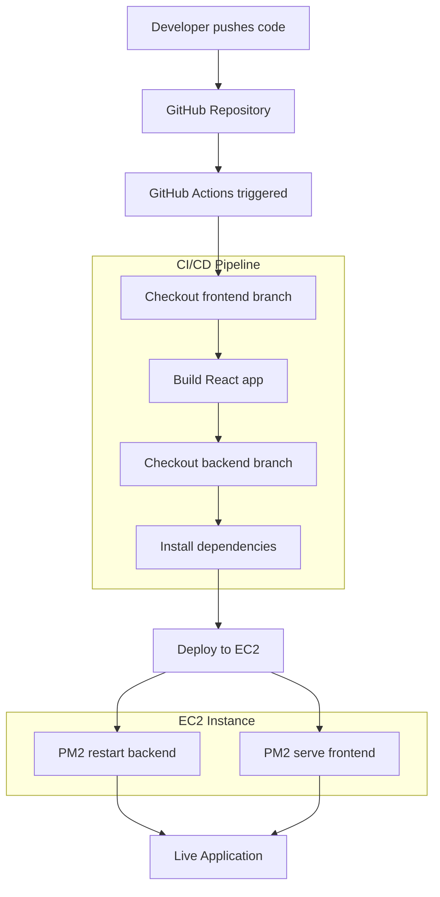

# Technical Documentation

## Architecture Overview

The system follows a MERN stack architecture with both frontend and backend deployed on a single AWS EC2 instance, communicating with MongoDB Atlas cloud database.

---

## Tech Stack

| Layer | Technology | Purpose |
|-------|------------|---------|
| **Frontend** | React.js | User interface |
| | Bootstrap | Styling and responsive design |
| | Axios | API communication |
| **Backend** | Node.js | Server runtime |
| | Express.js | API framework |
| | Mongoose | MongoDB object modeling |
| **Database** | MongoDB Atlas | Cloud database |
| **Deployment** | AWS EC2 | Virtual server |
| | PM2 | Process manager |
| | Application Load Balancer | Traffic routing |
| | GitHub Actions | CI/CD pipeline |
| **Tools** | npm | Package manager |
| | Postman | API testing |

---

## AWS Infrastructure

| Component | Details |
|-----------|---------|
| **Region** | US East (Virginia) - us-east-1 |
| **VPC** | Default VPC with public subnet |
| **Instance** | 1 EC2 instance (Frontend + Backend) |
| **Load Balancer** | Application Load Balancer with custom domain |
| **Security** | Security groups with HTTPS access |

**Terms Explained:**

- **EC2**: Virtual server in the cloud
- **VPC**: Isolated network for your resources
- **Public Subnet**: Network allowing internet access
- **PM2**: Keeps applications running continuously
- **Load Balancer**: Routes traffic to frontend (port 3000) and backend (port 8000)

---

## Deployment Architecture

```mermaid
flowchart TB
    User((User)) --> LB[Load Balancer + Domain]
    LB -->|Rule 1: Port 3000| FE[Frontend React]
    LB -->|Rule 2: Port 8000| BE[Backend Express]
    
    subgraph EC2["EC2 Instance"]
        FE
        BE
    end
    
    BE <-->|Mongoose| DB[(MongoDB Atlas)]
```

**How it works:**

- Load balancer routes domain traffic
- Target Rule 1: Frontend (port 3000)
- Target Rule 2: Backend API (port 8000)
- Both applications managed by PM2

---

## Data Flow Diagram

### Level 0: System Context

```mermaid
flowchart TB
    User((User)) --> System[Hotel Booking System]
    System --> Database[(MongoDB Atlas)]
```

### Level 1: Main System Flow

```mermaid
flowchart LR
    User((User)) --> LB[Load Balancer]
    LB --> FE[React Frontend]
    LB --> BE[Express Backend]
    BE <-->|Mongoose| DB[(MongoDB Atlas)]
```

### Level 2: Detailed Data Flow

```mermaid
flowchart TD
    User((User)) --> LB[Load Balancer]
    
    subgraph EC2["EC2 Instance"]
        direction TB
        FE[Frontend React<br/>Port 3000<br/>PM2]
        BE[Backend Express<br/>Port 8000<br/>PM2]
    end
    
    subgraph Database["MongoDB Atlas"]
        Users[(Users)]
        Hotels[(Hotels)]
        Bookings[(Bookings)]
    end
    
    LB -->|Route to :3000| FE
    LB -->|Route to :8000| BE
    
    FE -->|1. Search Hotels| BE
    BE -->|2. Query| Hotels
    Hotels -->|3. Results| BE
    BE -->|4. Response| FE
    
    FE -->|5. Book Room| BE
    BE -->|6. Check User| Users
    BE -->|7. Create Booking| Bookings
    Bookings -->|8. Confirmation| BE
    BE -->|9. Success| FE
    FE --> LB
    LB --> User
```

---

## Authentication Flow

```mermaid
flowchart TD
    A[User enters credentials] --> B[Frontend sends POST /login]
    B --> C[Backend validates credentials]
    C --> D{Valid User?}
    D -->|Yes| E[Return user data]
    D -->|No| F[Return error]
    E --> G[Store in localStorage]
    G --> H[User logged in]
    F --> I[Show error message]
```

**How it works:**
1. User enters email and password
2. Backend checks credentials against Users collection
3. Valid users get data stored in browser localStorage
4. Required for booking and profile access

---

## Authorization Levels

```mermaid
flowchart TD
    A[User Access] --> B{Check User Role}
    B -->|isAdmin: true| C[Admin Dashboard]
    B -->|isAdmin: false| D[User Pages]
    B -->|Not Logged In| E[Login Page]
    
    C --> C1[Manage Hotels]
    C --> C2[Manage Bookings]
    C --> C3[View Users]
    
    D --> D1[Search Hotels]
    D --> D2[Book Rooms]
    D --> D3[View Profile]
```

**Access Levels:**
- **Normal User**: Search, view, and book hotels
- **Admin**: Full system management access

---

## API Communication

### User Operations

| Endpoint | Method | Purpose |
|----------|--------|---------|
| `/api/users/register` | POST | Create new user |
| `/api/users/login` | POST | Authenticate user |

### Hotel Operations

| Endpoint | Method | Purpose |
|----------|--------|---------|
| `/api/hotels` | GET | Fetch all hotels |
| `/api/hotels/:id` | GET | Fetch hotel details |
| `/api/hotels/add` | POST | Add hotel (admin) |
| `/api/hotels/update/:id` | PUT | Update hotel (admin) |

### Booking Operations

| Endpoint | Method | Purpose |
|----------|--------|---------|
| `/api/bookings` | POST | Create booking |
| `/api/bookings/user/:id` | GET | Get user bookings |
| `/api/bookings/all` | GET | Get all bookings (admin) |

---

## Deployment Pipeline

```mermaid
flowchart TD
    A[Developer pushes code] --> B[GitHub Repository]
    B --> C[GitHub Actions triggered]
    
    subgraph CI/CD["CI/CD Pipeline"]
        D[Checkout frontend branch]
        E[Build React app]
        F[Checkout backend branch]
        G[Install dependencies]
    end
    
    C --> D
    D --> E
    E --> F
    F --> G
    
    G --> H[Deploy to EC2]
    
    subgraph EC2["EC2 Instance"]
        I[PM2 restart backend]
        J[PM2 serve frontend]
    end
    
    H --> I
    H --> J
    I --> K[Live Application]
    J --> K
```

**Deployment Steps:**

1. Code pushed to GitHub (separate frontend/backend branches)
2. GitHub Actions runs automated deployment
3. Frontend: Build React app → Serve with PM2
4. Backend: Install dependencies → Run with PM2
5. Load balancer routes traffic to both services

---

## Data Storage

**localStorage (Browser):**

- Logged-in user information
- Session management

**MongoDB Collections:**

- Users collection (authentication data)
- Hotels collection (hotel and room data)
- Bookings collection (reservation records)