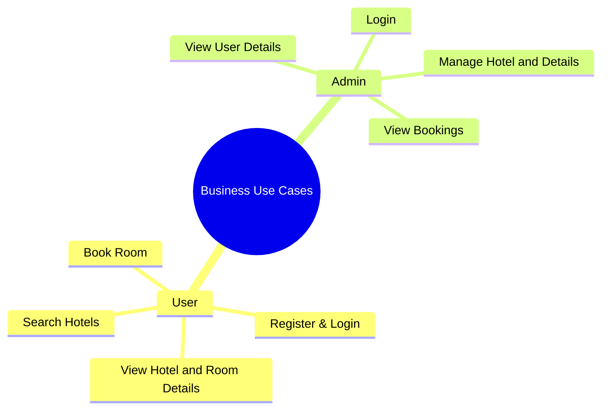
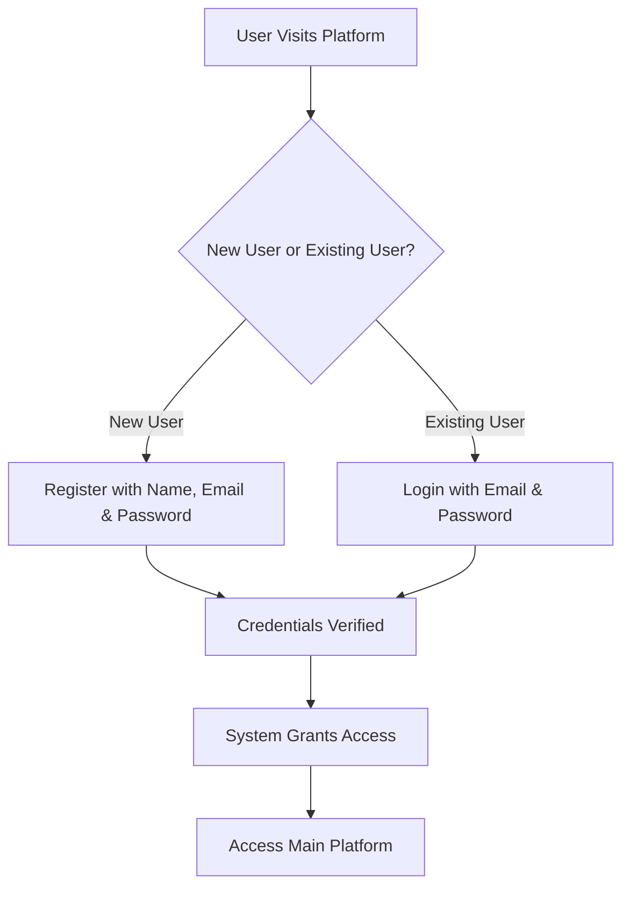
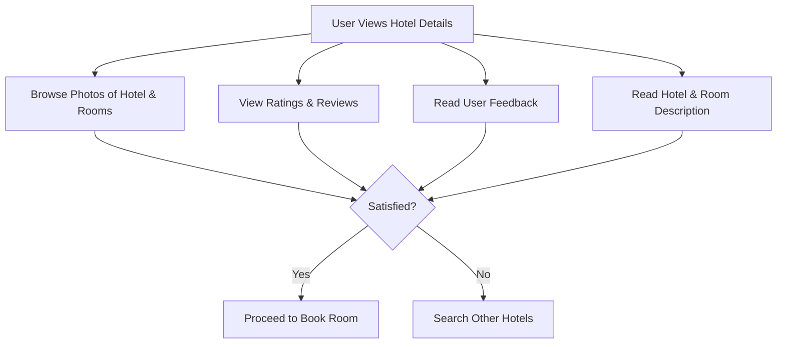
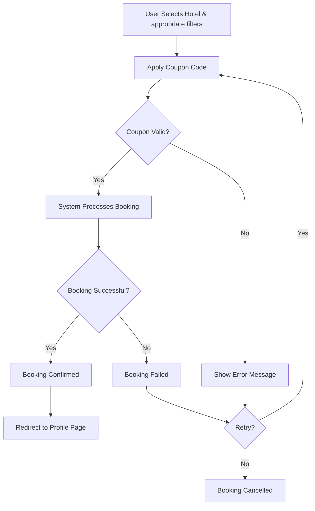

# Business Use Cases

It describes how a user interacts with the system to achieve a specific goal.

---

## 1. Business Use Case Overview

---

## 2. Detailed Use Cases

### UC-01: User Registration & Login

**Actor:** User  
**Goal:** Provide a secure entry point to the system

**Business Value:**

- Ensures only validated users access booking functionality
- Creates trackable user profiles for future operations

**Main Flow:**

---

### UC-02: View Hotel Details

**Actor:** User  
**Goal:** Allow users to browse hotels using filters and view detailed information including ratings and user feedback

**Business Value:**

- Improves user confidence in booking through transparency
- Reduces cancellation rate due to well-informed decisions

**Features Display:**

---

### UC-03: Book a Room

**Actor:** User  
**Goal:** Enable users to complete room reservations using coupon codes with proper validation and error handling

**Business Value:**

- Direct revenue generation
- Smooth checkout improves trust and platform engagement

**Booking Flow:**

---
