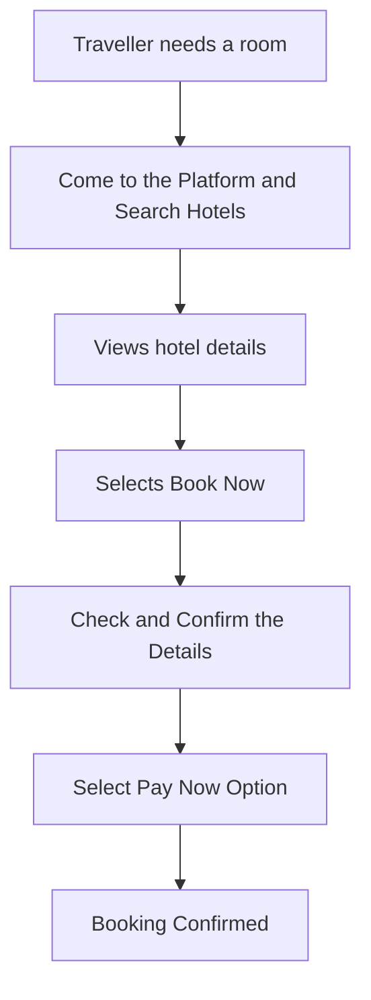
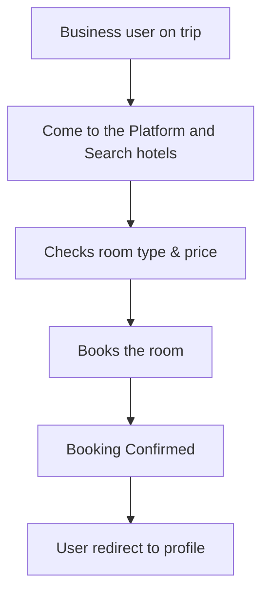

# Business Use Case — Hotel Booking System

## Overview
This system enables users to find and book hotel rooms through a simple online process.

---

## Use Case 1: Traveller Books a Room

```mermaid
flowchart TD
    A[Traveller needs a room] --> B[Come to the Platform and Search Hotels]
    B --> C[Views hotel details]
    C --> D[Selects Book Now]
    D --> E[Check and Confirm the Details]
    E --> F[Select Pay Now Option]
    F --> G[Booking Confirmed]
```

---

## Use Case 2: Business Trip User Books a Room

```mermaid
flowchart TD
    A[Business user on trip] --> B[Come to the Platform and Search hotels]
    B --> C[Checks room type & price]
    C --> D[Books the room]
    D --> E[Booking Confirmed]
    E --> F[User redirect to profile]
```

