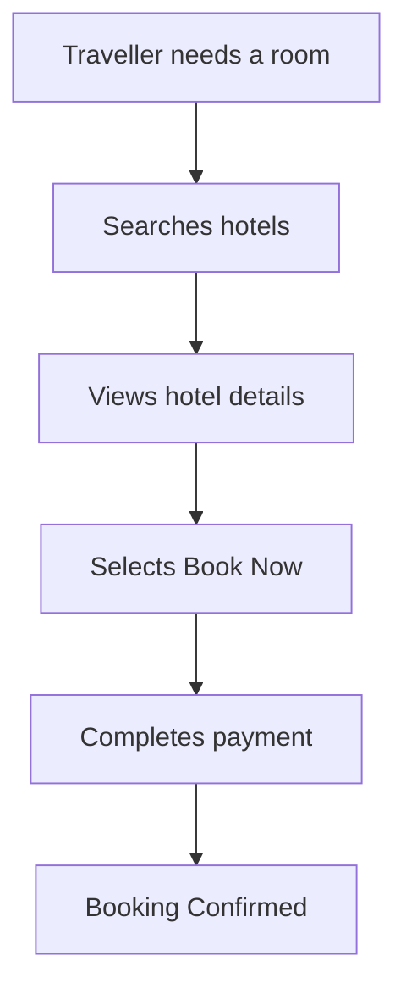
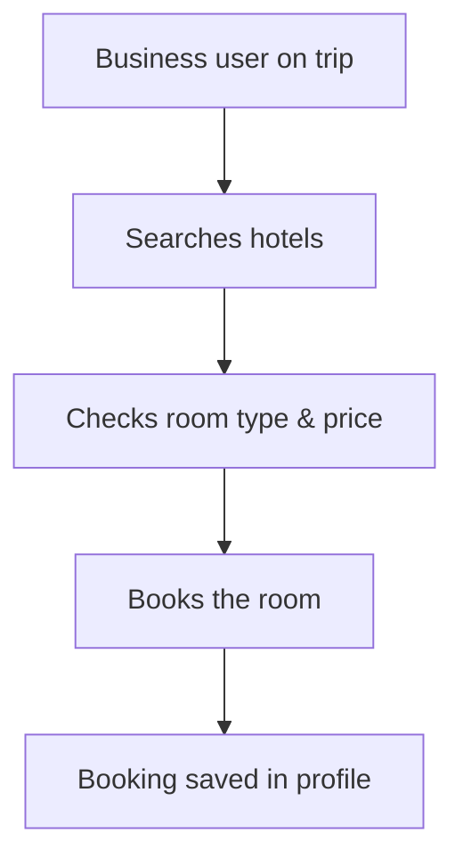

# Business Use Case — Hotel Booking System

## Overview
This system enables users to find and book hotel rooms through a simple online process.

---

## Use Case 1: Traveller Books a Room

**Scenario:** A traveller arrives in a new city and needs accommodation.

**Business Flow:**

```mermaid
flowchart TD
    A[Traveller needs a room] --> B[Searches hotels]
    B --> C[Views hotel details]
    C --> D[Selects Book Now]
    D --> E[Completes payment]
    E --> F[Booking Confirmed]
```

**Business Value:** Quick room booking for travelers on the go.

---

## Use Case 2: Business Trip User Books a Room

**Scenario:** A professional traveling for work needs a suitable room to check in immediately.

**Business Flow:**

```mermaid
flowchart TD
    A[Business user on trip] --> B[Searches hotels]
    B --> C[Checks room type & price]
    C --> D[Books the room]
    D --> E[Booking saved in profile]
```

**Business Value:** Fast, reliable booking for business travelers.