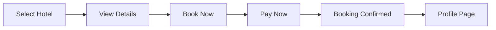

# Hotel Booking System - Functional Requirements

## 1. User Features

### 1.1 Authentication

| Function | Description |
|----------|-------------|
| Registration | Create account with name, email, password |
| Login | Sign in and access homepage |
| Logout | End session |

---

### 1.2 Search & Filter Hotels

| Filter | Description |
|--------|-------------|
| Search Bar | Search by hotel name or keyword |
| Check-in/Check-out | Select dates |
| Number of Persons | Filter by occupancy |
| Room Category | Deluxe / Non-Deluxe |

---

### 1.3 View Hotels

- Hotel cards show: name, price, description, "Book Now" button
- "View Details" shows: images, price, full description

---

### 1.4 Booking Flow

```mermaid
flowchart LR
    A[Select Hotel] --> B[View Details]
    B --> C[Book Now]
    C --> D[Pay Now]
    D --> E[Booking Confirmed]
    E --> F[Profile Page]
```

---

### 1.5 User Profile

| Feature | Description |
|---------|-------------|
| Booking History | View all bookings |
| Booking Details | Hotel, dates, room type, status |

---

## 2. Admin Features

### 2.1 Hotel & Room Management

| Function | Description |
|----------|-------------|
| Add Hotel/Room | Add new entries |
| Edit Hotel/Room | Update information |
| View Hotels/Rooms | List all entries |

---

### 2.2 Booking Management

| Function | Description |
|----------|-------------|
| View All Bookings | List all bookings |
| Booking Details | User, hotel, dates, room info |

---

### 2.3 User Management

| Function | Description |
|----------|-------------|
| View Users | List all users |
| User Details | User info and bookings |

---

## 3. Out-of-Scope

- Location filter
- Map integration
- Delete hotels, rooms, users
- Multiple admins
- Payment gateway