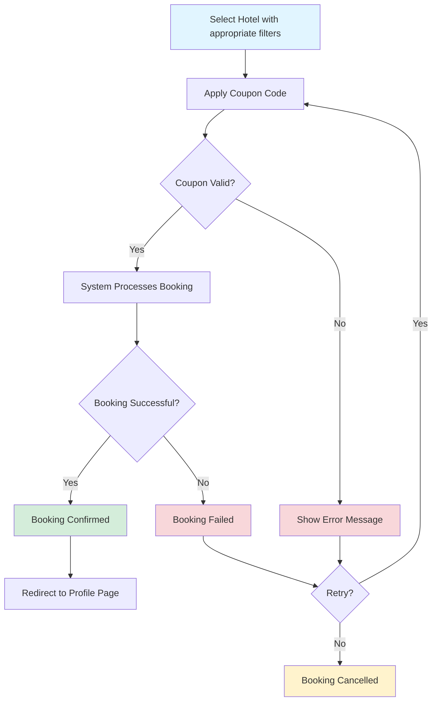

# Functional Requirements

It describes the primary functional requirements of the Hotel Room Booking System. It captures both user-side and admin-side functionalities.

---

## 1. User Functional Requirements

### 1.1 User Authentication

| Function | Description |
|----------|-------------|
| User Registration | Users create an account using Name, email and password |
| User Login | Authenticates user and loads homepage |
| Logout | Ends the session securely |

---

### 1.2 Hotel Search & Filters

The homepage provides a comprehensive search and filtering system.

| Filter / Input | Description |
|----------------|-------------|
| Search Bar | Search hotels by name, area or keyword |
| Start & End Date | Select check-in and check-out dates |
| Number of Persons | Filter based on occupancy requirements |
| Room Category | Deluxe / Non-deluxe options |

---

### 1.3 Hotel Listing & Details

Users can:

- View hotel cards with name, price, description, and "Book Now" button
- Click **View Details** to open a carousel showing:
    - Images
    - Price
    - Descriptions

---

### 1.4 Booking Module

#### Booking Flow Diagram

#### Booking Features

| Feature | Description |
|---------|-------------|
| Coupon Application | Apply discount coupons during checkout |
| Coupon Validation | **Valid Coupons:** Active, non-expired, meets minimum booking amount, applicable to selected hotel category **Invalid Coupons:** Expired, already used (if single-use), below minimum amount, not applicable to room type |
| Booking Confirmation | Display success message with booking details |

---

### 1.5 Hotel Reviews & Ratings

| Feature | Description |
|---------|-------------|
| View Ratings | Display average hotel rating (1-5 stars) on hotel cards and detail pages |
| Read Reviews | Browse user feedback and experiences from past guests |
| Rating Summary | Show rating breakdown (number of 5-star, 4-star, etc. reviews) |

---

## 2. Admin Functional Requirements

### 2.1 Hotel Management

| Function | Description |
|----------|-------------|
| Add Hotel | Create new hotel listings with details and images |
| Edit Hotel | Update existing hotel information |
| View Hotels | Browse all hotels in the system |
| Delete Hotel | Remove hotels from the database |

---

### 2.2 Booking Management

| Function | Description |
|----------|-------------|
| View All Bookings | See complete list of all bookings |
| Booking Details | View user info, hotel, dates, and payment status |

---

### 2.3 User Management

| Function | Description |
|----------|-------------|
| View Users | List all registered users |
| User Details | View user profile and booking history |

---

## 3. Scope (In-Scope and Out-of-Scope)

| Category | In-Scope (Current) | Out-of-Scope (Future) |
|---------|---------------------|------------------------|
| User | Login, search, booking | Cancel bookings, wishlist, profile management, booking history |
| Admin | Add/view hotels, view bookings | Analytics dashboard, role permissions |
| System | Coupon, filters | Real payment |

---

